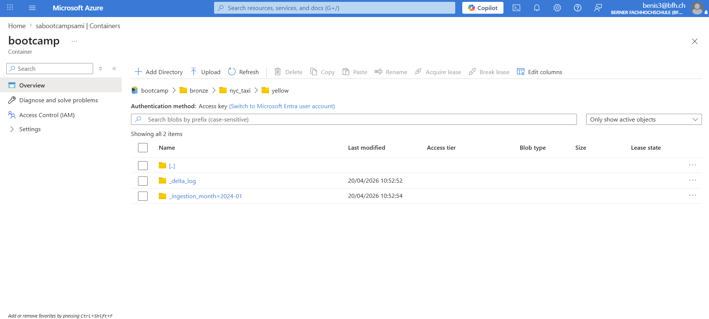
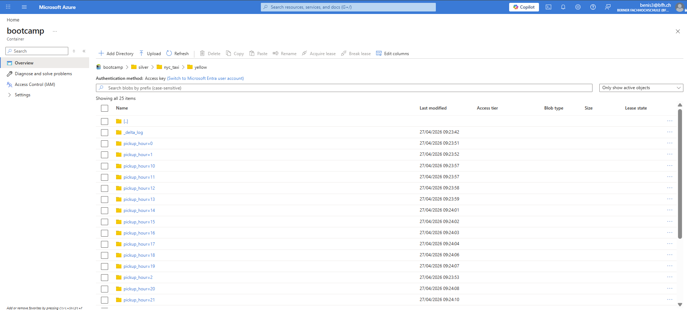
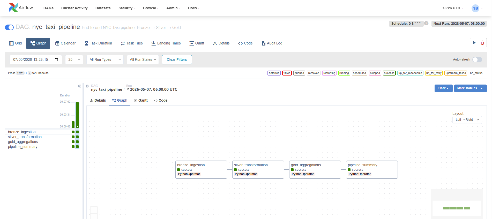
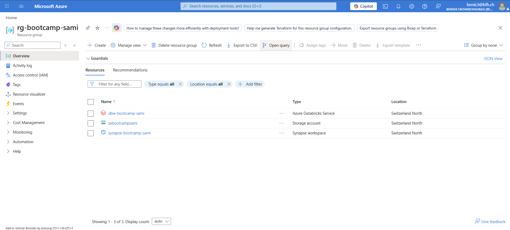
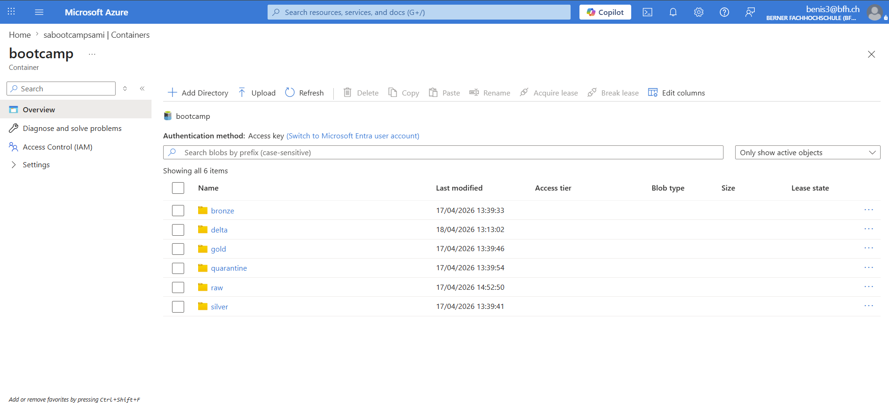
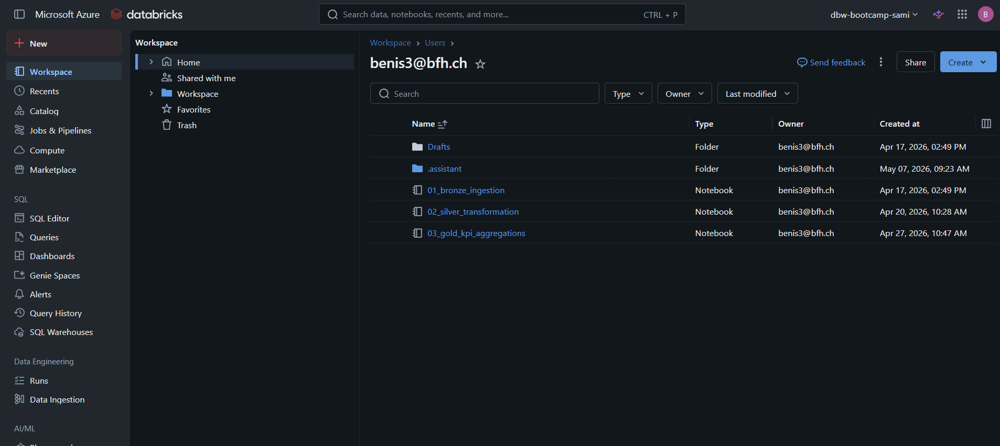
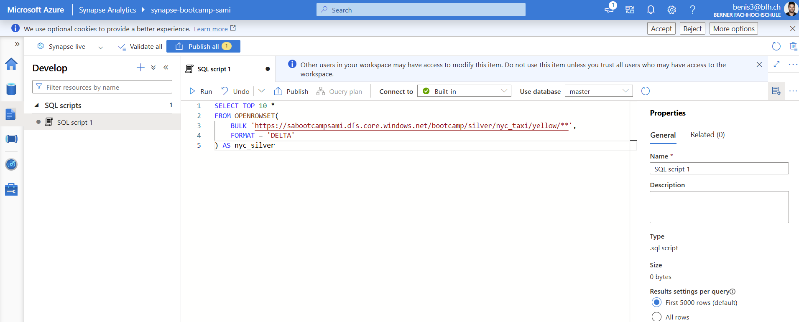
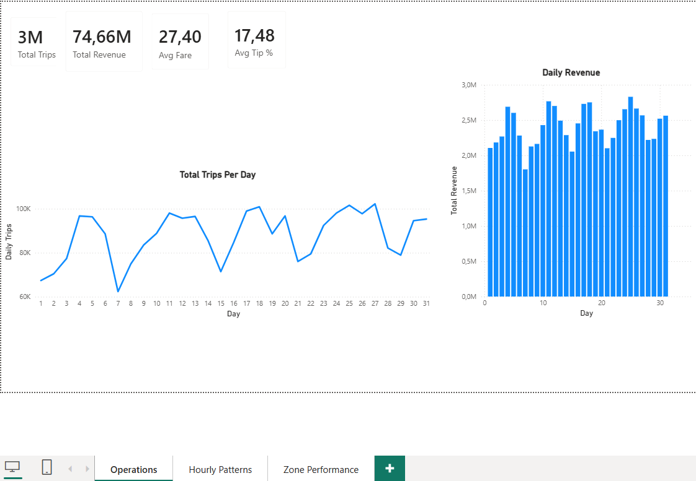
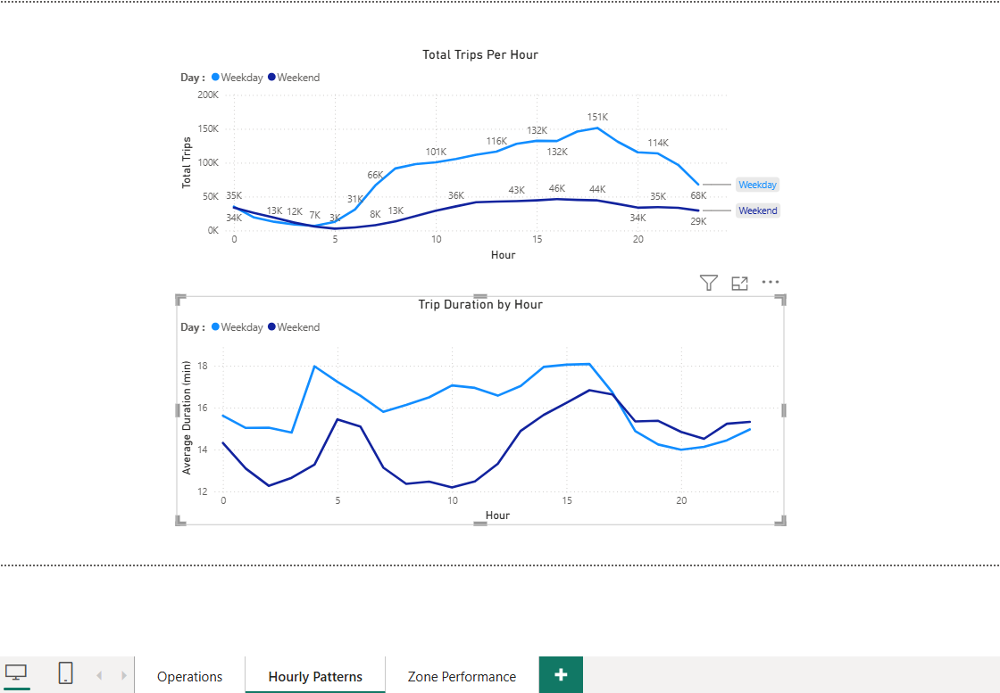
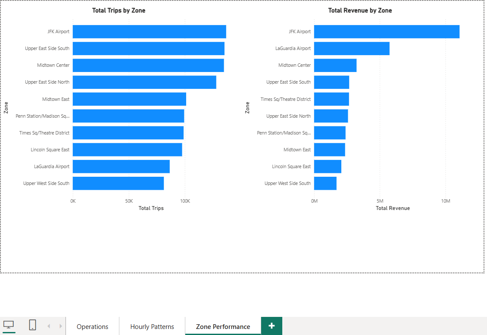

# NYC Taxi Data Pipeline — End-to-End Data Engineering Project

An end-to-end data pipeline built on the NYC Yellow Taxi dataset (January 2024, ~3M trips), following the Medallion architecture (Bronze → Silver → Gold), orchestrated with Apache Airflow, validated with Great Expectations, and visualized in Power BI.

---

## What this project demonstrates

- **Medallion architecture** — structured Bronze/Silver/Gold data lake with enforced quality gates at each layer
- **Data quality framework** — two-stage QC filter with a granular quarantine layer (7 rejection codes) and Great Expectations validation
- **Pipeline orchestration** — Apache Airflow DAG with task dependencies, FileSensor, XComs, and Taskflow API
- **Distributed processing** — PySpark with Delta Lake, broadcast joins, and partition-aware writes
- **Cloud infrastructure** — Azure Databricks, ADLS Gen2, and Synapse Serverless SQL
- **BI visualization** — Power BI dashboards consuming Gold KPI tables across 3 analytical perspectives

---

## Architecture

```
NYC TLC Source (Parquet)
        │
        ▼
┌─────────────────────┐
│   BRONZE LAYER      │  Raw ingestion — no transformations
│   Delta format      │  Partitioned by ingestion month
│   ~3M rows          │
└─────────────────────┘
        │
        ▼
┌─────────────────────┐
│   SILVER LAYER      │  Two-stage QC filter
│   Delta format      │  ├─ Stage 1: Null / type / range checks
│   Cleaned data      │  └─ Stage 2: Business rule validation
└─────────┬───────────┘
          │                      ┌──────────────────────┐
          │──── rejected rows ──▶│  QUARANTINE LAYER    │
          │                      │  7 rejection codes   │
          │                      └──────────────────────┘
          │
          ▼
  [Great Expectations gate]
  (fails pipeline if pass rate < 95%)
          │
          ▼
┌─────────────────────┐
│   GOLD LAYER        │  KPI aggregations (3 tables)
│   CSV export        │  daily_metrics / hourly_patterns / zone_performance
└─────────────────────┘
        │
        ▼
  [Power BI Dashboards]
  3 pages — Operations / Hourly Patterns / Zone Performance
```

---

## Tech Stack

| Layer | Technology |
|---|---|
| Processing | PySpark 3.x, Delta Lake |
| Orchestration | Apache Airflow 2.x (Docker, LocalExecutor, Postgres metadata DB) |
| Data Quality | Great Expectations (stable PandasDataset API) |
| Cloud Storage | Azure ADLS Gen2 |
| Cloud Compute | Azure Databricks |
| SQL Query Layer | Azure Synapse Serverless SQL |
| Containerization | Docker + docker-compose |
| Visualization | Power BI Desktop |
| Version Control | Git / GitHub |

---

## Pipeline — Layer by Layer

### Bronze — Raw Ingestion (`notebooks/01_bronze.ipynb`)

Reads Yellow Taxi Parquet from the NYC TLC source and writes to Delta with no transformations. Only metadata columns are added (`ingestion_timestamp`, `source_file`). Every row is ingested, including corrupt ones — Bronze is an immutable archive.

Data is partitioned by ingestion month on ADLS Gen2:



### Silver — Cleaning & Validation (`notebooks/02_silver.ipynb`)

**Stage 1 — Technical filter:** nulls, type mismatches, out-of-range values.

**Stage 2 — Business rules:** negative fares, trip duration < 1 min or > 4 hours, implausible distances.

Rejected rows are written to a quarantine table with one of 7 rejection codes (`NULL_PICKUP_LOCATION`, `NEGATIVE_FARE`, `ZERO_DISTANCE`, `IMPLAUSIBLE_DURATION`, `INVALID_PASSENGER_COUNT`, `FUTURE_PICKUP`, `FARE_DISTANCE_MISMATCH`).

**Great Expectations gate:** validates pass rates on critical columns. Pipeline fails if rate falls below 95%.

Silver is partitioned by `pickup_hour` for efficient downstream queries:



### Gold — KPI Aggregations (`notebooks/03_gold.ipynb`)

Three aggregation tables built from Silver:

| Table | Rows | Description |
|---|---|---|
| `daily_metrics` | 31 | Trips, revenue, avg fare per day |
| `hourly_patterns` | 48 | Trips and duration by hour × weekday/weekend |
| `zone_performance` | 253 | Trips, revenue, avg fare, avg distance per pickup zone |

### Airflow DAG (`airflow/dags/nyc_taxi_pipeline.py`)

```
file_sensor ──▶ bronze_ingestion ──▶ silver_transformation ──▶ gold_aggregations ──▶ pipeline_summary
```

Built with Taskflow API. FileSensor watches for source file arrival before triggering ingestion. XComs pass row counts between tasks for lineage tracking.



---

## Cloud Infrastructure (Azure)

The full pipeline was deployed on Azure. The infrastructure consisted of 3 resources in a single resource group:



**ADLS Gen2** (`sabootcampsami`) hosted the full Medallion structure — bronze, silver, gold, and quarantine layers as separate folders within the bootcamp container:



**Azure Databricks** (`dbw-bootcamp-sami`) hosted the 3 pipeline notebooks:



**Azure Synapse Serverless SQL** (`synapse-bootcamp-sami`) provided a SQL query layer directly over the Delta files on ADLS Gen2 via `OPENROWSET`:



---

## Power BI Dashboards

### Dashboard 1 — Operations



4 KPI cards (3M total trips, $74.7M total revenue, $27.40 avg fare, 17.5% avg tip rate) with daily trips line chart and daily revenue column chart. The recurring dip on days 7, 14, 21, 28 confirms weekend demand reduction.

### Dashboard 2 — Hourly Patterns



Weekday vs weekend comparison across 24 hours. Weekdays show a classic bimodal curve (morning rush + evening peak at 17h). Weekends show a flat, gradual curve peaking mid-afternoon — consistent with leisure travel. Trip duration on weekdays spikes at 4-5am (airport runs) and again at 15-17h (rush hour congestion).

### Dashboard 3 — Zone Performance



Top 10 zones by total trips and total revenue. JFK Airport leads both rankings. LaGuardia ranks #9 by trip count but #2 by revenue — airport fare surcharges generate disproportionate revenue per trip. Manhattan zones (Midtown, Upper East Side) dominate non-airport demand.

---

## Repository Structure

```
nyc-taxi-data-pipeline/
├── notebooks/
│   ├── 01_bronze.ipynb              # Raw ingestion
│   ├── 02_silver.ipynb              # Cleaning + GE validation
│   └── 03_gold.ipynb                # KPI aggregations
├── airflow/
│   └── dags/
│       ├── nyc_taxi_pipeline.py     # Main DAG
│       └── pipeline/                # Task modules
├── docs/
│   └── screenshots/
│       ├── dag_success.png
│       ├── RG.png
│       ├── containers.png
│       ├── databricks_workspace.png
│       ├── bronze_partition.png
│       ├── silver_partition.png
│       ├── Synapse_sqleditor.png
│       ├── Operations.png
│       ├── Hourly_Patterns.png
│       └── Zone_Performance.png
├── docker-compose.yml
├── Dockerfile
└── README.md
```

---

## How to Run

**Prerequisites:** Docker, Docker Compose

```bash
# 1. Clone the repository
git clone https://github.com/sami-beniaouf/nyc-taxi-data-pipeline.git
cd nyc-taxi-data-pipeline

# 2. Start Airflow
docker-compose up -d

# 3. Access Airflow UI at http://localhost:8081

# 4. Enable and trigger the DAG: nyc_taxi_pipeline

# 5. Source data (Yellow Taxi Jan 2024)
# Download from: https://d37ci6vzurychx.cloudfront.net/trip-data/yellow_tripdata_2024-01.parquet
# Place in: data/raw/
```

---

## Future Improvements

- **Service Principal authentication** — replace storage account key with Azure AD Service Principal + Databricks Secret Scopes
- **Multi-month incremental ingestion** — append-mode Bronze loads partitioned by month for full-year dataset (~40 GB)
- **CI/CD** — GitHub Actions workflow for linting, unit tests, and Great Expectations validation on PRs
- **Streaming layer** — Kafka + Spark Structured Streaming for real-time trip ingestion

---

## About

Built as the capstone of a self-directed Data Engineering program covering PySpark, Airflow, Great Expectations, Azure, Databricks, Synapse and Power BI.

**Sami Beniaouf** — [github.com/sami-beniaouf](https://github.com/sami-beniaouf)
